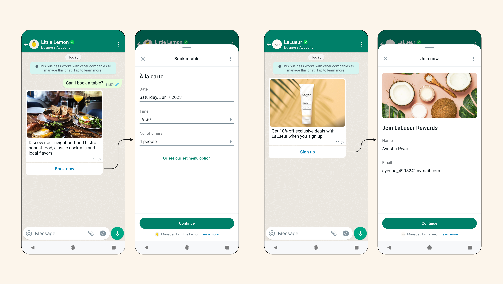

# WhatsApp Flows

> WhatsApp Flows is a way to build structured interactions for business messaging. With Flows, businesses can define, configure, and customize messages with rich interactions that give customers more structure in the way they communicate.

If you want access to the complete Meta documentation regarding Flows, [click here](https://developers.facebook.com/docs/whatsapp/flows).

## Learn About WhatsApp Flows

- [Components](COMPONENTS.md)
