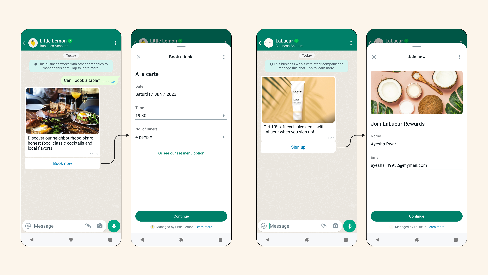

# WhatsApp Flows

> `WhatsApp Flows` é uma forma de construir interações estruturadas para mensagens comerciais. Com o `Flows`, as empresas podem definir, configurar e personalizar mensagens com interações ricas que dão aos clientes mais estrutura na forma como se comunicam.

Se você deseja acessar a documentação completa do Meta sobre `Flows`, [clique aqui](https://developers.facebook.com/docs/whatsapp/flows).

## Aprenda sobre WhatsApp Flows

- [Componentes](components/README.md)
- [Tipos de Flows](types-of-flows/README.md)
- [Flows dinâmicos](dynamic-flows/README.md)
  - [Endpoint](dynamic-flows/README.md#endpoint)
- [Exemplos](samples/README.md)
